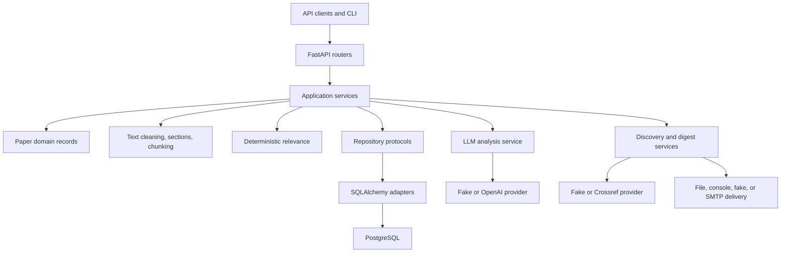
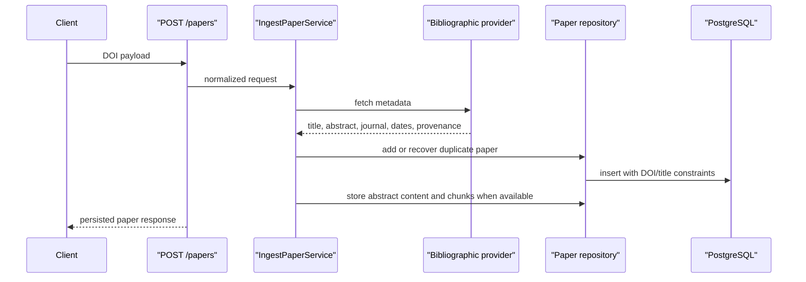
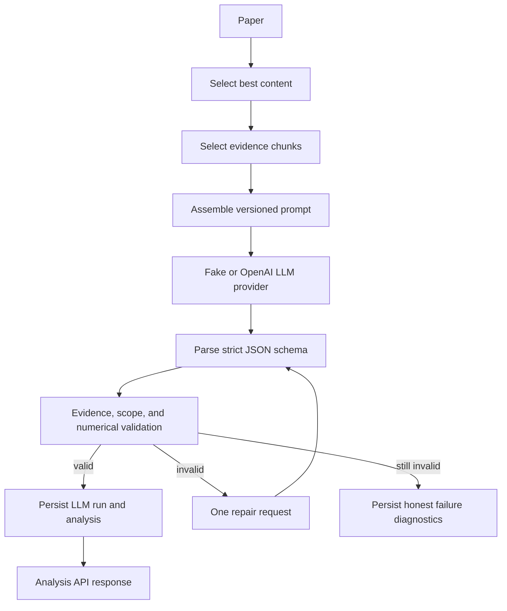
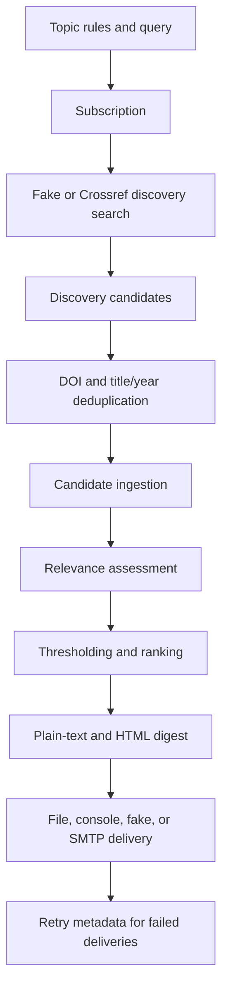
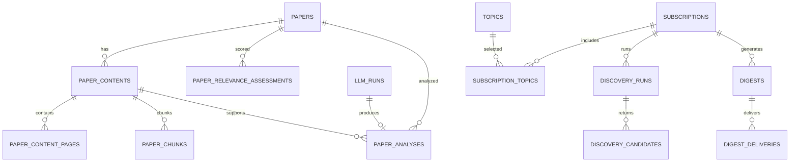
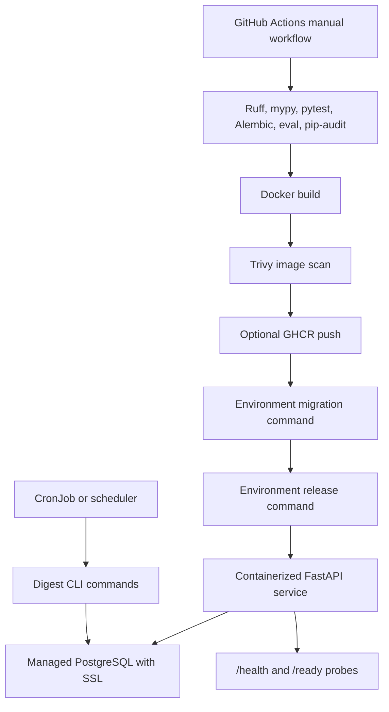

# Architecture

MRInsight is a modular monolith. FastAPI maps HTTP requests, application services coordinate workflows, domain records define boundaries, repositories persist state, and provider adapters isolate external services.

## Component Architecture

FastAPI routes own request and response mapping. Services own workflow decisions. Repositories flush but do not commit; request-scoped dependencies own commit and rollback.

## DOI Ingestion

## PDF Extraction

```mermaid
flowchart LR
    Upload["Permitted PDF upload"] --> Validate["MIME, extension, size, and parser validation"]
    Validate --> Extract["pypdf extraction"]
    Extract --> Pages["page-level text records"]
    Pages --> Clean["text cleaning and checksum"]
    Clean --> Sections["section detection"]
    Sections --> Chunks["section-aware evidence chunks"]
    Chunks --> Content["full-text content state"]
    Content --> DB["PostgreSQL"]
```

PDF extraction records parser version, checksum, extraction status, page offsets, chunk ranges, and failure reasons. The app does not OCR scanned documents.

## Analysis

The LLM cannot introduce uncited reported claims. Abstract-only evidence cannot be labelled as full text. Numerical results must cite evidence containing the value text.

## Discovery And Digest

Manual previews and scheduled one-shot CLI commands use the same service path.

## Data Model

JSONB is used for structured diagnostics and versioned payloads at repository boundaries: relevance categories, matched concepts, selected chunk IDs, validation errors, topic rules, preferred categories, analyses, and digest selected-paper payloads.

## Deployment

Deployment is intentionally gated. Image publishing and deployment run only when selected, and real secrets stay in the target environment or secret store.
