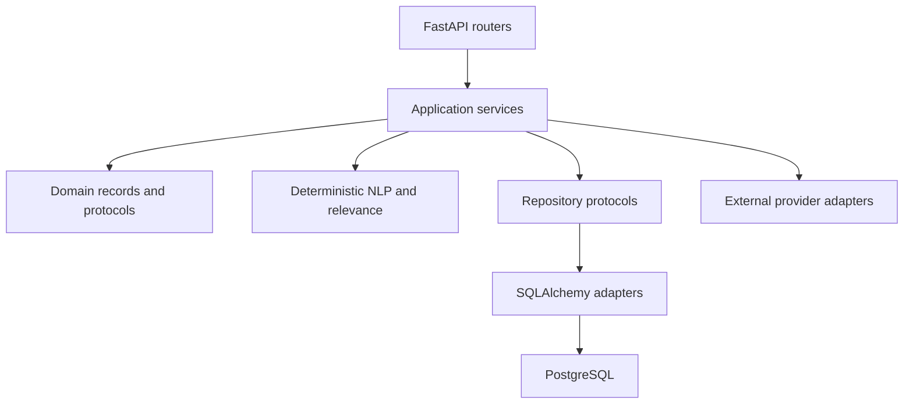

# Architecture

MRInsight is a modular monolith:

FastAPI routes own request/response mapping. Application services own workflow decisions. Repositories flush but do not commit; request-scoped dependencies own commit and rollback.

The deterministic evidence path is:

